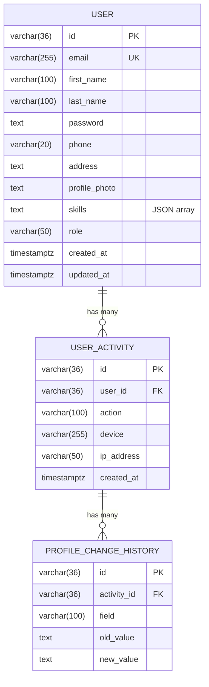

# Data Models

## Entity Relationship



## User

Table: `users`

| Field          | Type         | Constraints          | Description                          |
| -------------- | ------------ | -------------------- | ------------------------------------ |
| `id`           | varchar(36)  | PK                   | UUID v4                              |
| `email`        | varchar(255) | UNIQUE, NOT NULL     | Work email                           |
| `first_name`   | varchar(100) | NOT NULL             | Read-only after registration         |
| `last_name`    | varchar(100) | NOT NULL             | Read-only after registration         |
| `password`     | text         | NOT NULL             | bcrypt hash (never returned in JSON) |
| `phone`        | varchar(20)  |                      | Mobile phone number                  |
| `address`      | text         |                      | Residential address                  |
| `profile_photo`| text         |                      | URL path to uploaded photo           |
| `skills`       | text         |                      | JSON array, e.g. `["Go","React"]`    |
| `role`         | varchar(50)  | NOT NULL, default `user` | `user` or `admin`                |
| `created_at`   | timestamptz  | auto                 | Row creation timestamp               |
| `updated_at`   | timestamptz  | auto                 | Last update timestamp                |

### JSON Response

```json
{
  "id": "550e8400-e29b-41d4-a716-446655440000",
  "email": "alex.m@archmonolith.com",
  "first_name": "Alexander",
  "last_name": "Monolith",
  "phone": "+1 (555) 0123-4567",
  "address": "1248 Architecture Way, Suite 400",
  "profile_photo": "/uploads/abc123.jpg",
  "skills": ["React", "Go", "CI/CD"],
  "role": "user",
  "created_at": "2025-01-15T10:30:00Z",
  "updated_at": "2025-03-24T08:00:00Z"
}
```

> **Note:** `password` is never included in JSON output (`json:"-"`).

## UserActivity

Table: `user_activities`

| Field        | Type         | Constraints     | Description                                     |
| ------------ | ------------ | --------------- | ----------------------------------------------- |
| `id`         | varchar(36)  | PK              | UUID v4                                         |
| `user_id`    | varchar(36)  | INDEX, NOT NULL | FK → users.id                                   |
| `action`     | varchar(100) | NOT NULL        | E.g. "updated profile"                          |
| `device`     | varchar(255) |                 | User-Agent string                               |
| `ip_address` | varchar(50)  |                 | Client IP                                       |
| `created_at` | timestamptz  | auto            | When the action occurred                        |

## ProfileChangeHistory

Table: `profile_change_histories`

| Field        | Type         | Constraints     | Description                                     |
| ------------ | ------------ | --------------- | ----------------------------------------------- |
| `id`         | varchar(36)  | PK              | UUID v4 (not returned in JSON)                  |
| `activity_id`| varchar(36)  | INDEX, NOT NULL | FK → user_activities.id                         |
| `field`      | varchar(100) | NOT NULL        | Changed field (phone, email, skills, photo)     |
| `old_value`  | text         |                 | Previous value                                  |
| `new_value`  | text         |                 | New value                                       |

### JSON Response (Grouped History)

```json
{
  "id": "660e8400-e29b-41d4-a716-446655440001",
  "user_id": "550e8400-e29b-41d4-a716-446655440000",
  "action": "updated profile",
  "device": "Mozilla/5.0 (Macintosh; Intel Mac OS X 10_15_7) Chrome/120.0.0.0",
  "ip_address": "192.168.1.100",
  "created_at": "2025-03-24T08:00:00Z",
  "changes": [
    {
      "activity_id": "660e8400-e29b-41d4-a716-446655440001",
      "field": "phone",
      "old_value": "+1 (555) 000-0000",
      "new_value": "+1 (555) 0123-4567"
    },
    {
      "activity_id": "660e8400-e29b-41d4-a716-446655440001",
      "field": "skills",
      "old_value": "[\"Go\"]",
      "new_value": "[\"Go\",\"React\",\"CI/CD\"]"
    }
  ]
}
```

### Tracked Fields

| Field           | old_value / new_value format     |
| --------------- | -------------------------------- |
| `phone`         | plain string                     |
| `email`         | plain string                     |
| `address`       | plain string                     |
| `skills`        | JSON array, e.g. `["Go","React"]`|
| `profile_photo` | URL path string                  |
